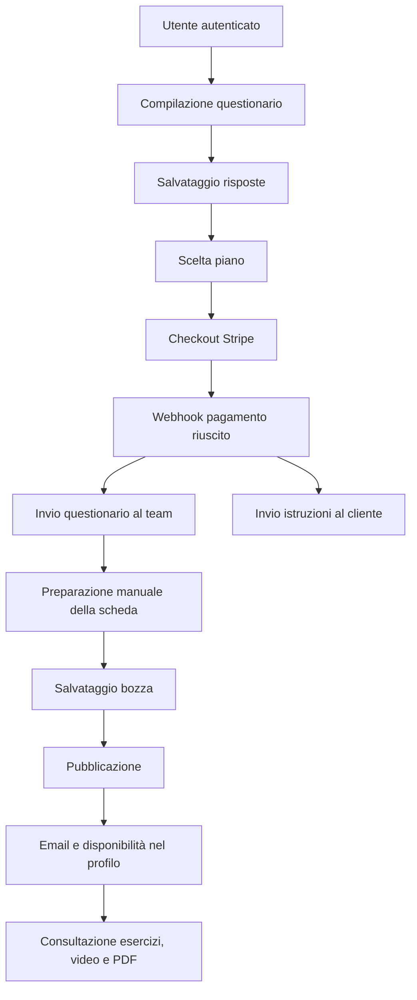
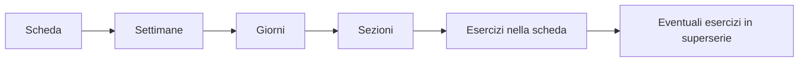
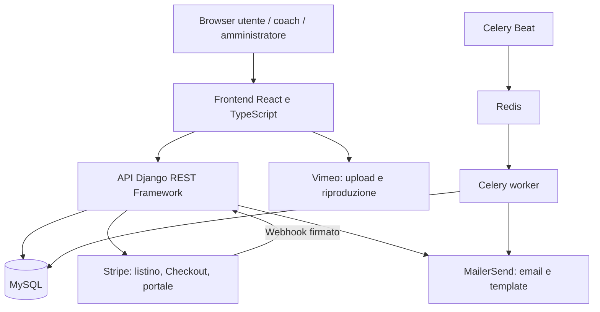

# Analisi funzionale di FitNexus

Documento ricostruito dal codice sorgente presente nel repository il 25 settembre 2026.

Aggiornamento: gli esiti delle successive prove pratiche locali del 30 settembre–2 ottobre, inclusi Docker, MySQL e browser, sono nel [rapporto di collaudo](ESITO_PROVE_LOCALI.md). Le dichiarazioni di analisi statica qui sotto descrivono il metodo originario di questo documento.

## 1. Finalità e metodo dell'analisi

Questo documento descrive lo scopo dell'applicazione, gli attori, i processi, le informazioni gestite e le regole funzionali. È una base per la documentazione di progetto, un manuale operativo o un capitolo di tesi.

L'analisi è **statica**: sono stati esaminati routing, pagine e componenti React, servizi HTTP, modelli Django, serializer, viste API, permessi, pagamenti, notifiche, task e configurazioni di distribuzione. Non sono stati eseguiti pagamenti, inviate email, avviati servizi o verificati flussi con utenti reali. La presenza di codice non equivale a una verifica del suo funzionamento in esercizio.

Nel documento si distinguono:

- **Implementato nel codice**: esiste una logica riconoscibile e collegata al sistema; rimane da validare a runtime.
- **Parziale o incoerente**: esistono componenti o API, ma il collegamento o le regole presentano problemi osservabili.
- **Non riscontrato**: non è stata individuata una funzione corrispondente nel perimetro esaminato.

I riferimenti `[S01]`–`[S20]` rimandano alla mappa delle fonti in fondo al documento. Il catalogo delle rotte è in [CATALOGO_INTERFACCE.md](CATALOGO_INTERFACCE.md).

## 2. Scopo dell'applicazione

FitNexus è una piattaforma web per proporre, acquistare e fruire di servizi di allenamento a distanza. Collega utenti che desiderano seguire un percorso di fitness e professionisti che preparano programmi di esercizio.

Il valore funzionale consiste nel riunire presentazione dei servizi, raccolta delle esigenze, acquisto, preparazione e consegna delle schede, consultazione dei video e raccolta dei feedback.

Il percorso oggi maggiormente evidenziato dall'interfaccia pubblica si basa su due servizi:

1. **Scheda personalizzata**: il cliente compila un questionario e acquista un piano; il trainer prepara una scheda destinata a quell'utente e la pubblica.
2. **Coaching online**: il cliente seleziona un coach e acquista un abbonamento; il sistema invia comunicazioni per avviare il rapporto di coaching.

Esiste inoltre un modulo di **schede tutorial**, organizzate in discipline, corsi e livelli acquistabili. È un sottosistema significativo nel codice, ma meno integrato nel profilo utente attuale rispetto alle schede personalizzate. Il sito permette anche di manifestare interesse per un nutrizionista. [S01, S03, S04, S05, S06]

L'applicazione non genera automaticamente i programmi a partire dal questionario: la personalizzazione è affidata al trainer. Non risultano motori di raccomandazione, intelligenza artificiale per la prescrizione degli esercizi o adattamenti automatici in base ai risultati.

### 2.1 Confini del sistema

| Incluso nel perimetro | Non riscontrato nel perimetro applicativo |
|---|---|
| Presentazione dei servizi e del team | Gestione ingressi in una palestra fisica |
| Registrazione, autenticazione e recupero password | Prenotazione di lezioni con calendario |
| Questionario iniziale | Chat o videochiamata tra cliente e coach |
| Abbonamenti tramite Stripe | Gestione interna completa della contabilità |
| Creazione e pubblicazione di schede | Generazione automatica delle schede |
| Esercizi e video dimostrativi | Diario strutturato delle sessioni effettivamente svolte |
| Feedback testuali e notifiche email | Grafici di progressione dei carichi o delle misure |
| Richiesta di contatto nutrizionale | Elaborazione e gestione di piani alimentari |

Questa delimitazione evita di attribuire alla piattaforma funzioni tipiche di altri gestionali fitness che qui non sono presenti.

## 3. Attori e responsabilità

| Attore | Obiettivo | Funzioni riconoscibili nell'interfaccia o nelle API |
|---|---|---|
| Visitatore | Conoscere il servizio e scegliere un percorso | Home, presentazione, team, servizi, catalogo tutorial, richiesta informazioni, registrazione |
| Utente registrato e verificato | Acquistare e seguire un programma | Login, questionario, scelta coach, checkout, schede pubblicate, video, PDF, gestione abbonamento tramite portale esterno |
| Cliente di un tutorial | Consultare il contenuto acquistato | Accesso al livello associato all'account |
| Trainer/coach | Preparare contenuti e seguire gli utenti | Pannelli video, esercizi, corsi/schede, anagrafica coach, composizione e pubblicazione delle schede |
| Amministratore applicativo | Configurare l'offerta commerciale | Creazione e modifica dei codici promozionali, creazione/modifica/disattivazione dei prodotti di abbonamento |
| Superutente Django | Amministrare il sistema | Accesso al back office Django secondo registrazioni dei modelli e permessi configurati |
| Nutrizionista | Ricevere richieste di contatto | Destinatario di email; non emerge un portale professionale distinto |
| Servizi esterni e processi automatici | Eseguire operazioni di supporto | Stripe, MailerSend, Vimeo, Celery e scheduler |

Il modello utente usa `is_trainer`, `is_staff` e `is_superuser`. La risposta di login espone i nomi `is_coatch` e `is_admin`; il frontend li memorizza e decide quali pannelli mostrare. Un utente può avere contemporaneamente i pannelli coach e amministratore. [S02, S03]

**Distinzione essenziale:** questa è la distribuzione funzionale delle responsabilità, non una garanzia dei permessi effettivi. Il controllo lato server non applica uniformemente tale separazione: si veda la sezione 14.

## 4. Mappa delle aree applicative

| Area | Contenuto | Modalità d'accesso |
|---|---|---|
| Sito pubblico | Home, descrizione attività, team, FAQ, servizi, contatto | Pagine pubbliche |
| Account | Login e registrazione nei componenti condivisi, verifica email, reset password | Componenti nel sito e pagine dedicate ai link email |
| Personalizzazione | Questionario iniziale | `/custom`, con invito ad autenticarsi se necessario |
| Coaching | Elenco coach e posti disponibili | `/coaching` |
| Acquisto | Scelta piano e rinvio a Stripe | `/payment`, con tipo di servizio passato dalla navigazione |
| Esito acquisto | Messaggio di successo o annullamento/fallimento | `/payment-succeeded`, `/payment-failed` |
| Area personale | Schede personalizzate pubblicate | `/profile` |
| Consultazione scheda | Selezione settimana e giorno, esercizi, video e PDF | `/personal/detail/user/:packPersId` |
| Tutorial | Catalogo, dettaglio commerciale e dettaglio acquistato | `/tutorial` e relative sottorotte |
| Feedback | Questionario breve accessibile con token | `/feedback?token=...` |
| Operatività coach/admin | Pannelli specializzati | Dentro `/profile`, secondo i flag di ruolo |
| Back office tecnico | Amministrazione Django e Swagger | Rotte backend `/admin/` e `/schema-swagger-ui/` |

La rotta di presentazione dei servizi è scritta nel codice come `/serveces-details`: questo nome va preservato nella documentazione delle interfacce finché non viene modificato. Le rotte frontend non riconosciute riportano alla home. [S01]

## 5. Gestione dell'account

### 5.1 Registrazione e verifica email

La registrazione acquisisce email, username, password, nome, cognome, genere e data di nascita. Email e username sono univoci; lo username deve essere alfanumerico. Il serializer impone alla password una lunghezza fra 6 e 68 caratteri. Esiste una verifica preventiva della disponibilità di email e username. [S02]

Il sistema crea un account inizialmente non verificato e prepara un'email con token di attivazione. La verifica valida il token e imposta `is_verified=True`. Alla prima verifica viene predisposta anche un'email informativa con due PDF allegati relativi al servizio e al nutrizionista.

Il login respinge credenziali errate, account disabilitati e indirizzi non verificati. È possibile autenticarsi con email oppure username. Le costanti relative a provider social non sono sufficienti a documentare un login Google/Facebook: nelle rotte esaminate non emerge un flusso OAuth completo.

### 5.2 Sessione, logout e recupero password

Il backend restituisce token JWT access e refresh. Nella configurazione esaminata la durata è rispettivamente un'ora e un giorno. Il frontend conserva token, email e indicatori del ruolo in `localStorage` e allega il bearer token alle richieste HTTP.

È previsto il rinnovo del token alla risposta HTTP 401, ma l'interceptor contiene incongruenze nella gestione della promessa e del refresh: non va descritto come un rinnovo trasparente già verificato.

Il logout dell'interfaccia rimuove i dati locali e ricarica la pagina. Esiste un'API di logout che tenta l'invalidazione del refresh token, ma il flusso frontend esaminato non la richiama. La cancellazione locale e la revoca server sono quindi due comportamenti distinti. [S02, S12]

Il recupero password prevede richiesta via email, link con identificativo utente codificato e token, verifica e impostazione della nuova password. La validazione server utilizza il generatore di token Django. Gli URL di ritorno devono essere coerenti con l'ambiente distribuito.

## 6. Servizio di scheda personalizzata

### 6.1 Acquisizione delle esigenze

L'utente autenticato accede a un questionario articolato in passi. Le domande sono definite nel frontend e includono campi obbligatori, facoltativi e condizionali. Le aree informative sono:

| Area | Informazioni raccolte |
|---|---|
| Dati fisici | Altezza, peso, immagine personale facoltativa |
| Condizioni dichiarate | Dolori, problemi posturali, infortuni, patologie |
| Abitudini | Stile di vita, stress, ore di sonno |
| Esperienza | Attività praticate, allenamento attuale/pregresso, esperienza con un coach |
| Obiettivi | Massa muscolare, perdita di peso, estetica, mobilità, resistenza e altre richieste |
| Disponibilità | Frequenza, giorni, durata desiderata delle sedute |
| Contesto | Casa, palestra, parco, HomeFitNexus; attrezzi e macchinari disponibili |
| Capacità dichiarate | Plank, piegamenti, squat, trazioni, massimali e test di mobilità |
| Alimentazione | Abitudini ed esperienze riportate dall'utente, interesse per il tema nutrizionale |

La fotografia viene convertita in una stringa Base64 e inserita fra le risposte. Non emerge un archivio fotografico separato. Le dichiarazioni dell'utente sono input per il lavoro del professionista, non diagnosi o misurazioni automatiche. [S04]

Il frontend verifica alcune risposte obbligatorie e dipendenze; ad esempio richiede approfondimenti sull'esperienza di allenamento o sulla distribuzione delle sedute in più luoghi. Il backend salva un nuovo `Survey` e le relative `Question` per ogni invio. La vista non ripete l'intera validazione funzionale del client e non invoca il serializer per validare il payload prima del salvataggio.

Il questionario è salvato **prima del pagamento**. Un questionario presente non prova quindi l'acquisto del servizio. Non emerge un legame univoco fra questionario e specifica transazione: la gestione post-pagamento usa il questionario più recente dell'utente.

### 6.2 Acquisto e avvio della lavorazione

Il diagramma descrive il flusso funzionale ricostruito, subordinato alla corretta configurazione delle integrazioni. L'avvio del lavoro del coach è mediato dalle comunicazioni email; non è presente un'entità ordine con stati come «da assegnare», «in lavorazione», «consegnato».

Il pagamento non crea automaticamente una scheda. La scheda nasce dall'azione del trainer e ha un utente destinatario, un nome e una struttura di allenamento. [S05, S08]

### 6.3 Composizione della scheda

Il pannello denominato «Connessione» permette di costruire la relazione fra destinatario o livello tutorial e programma di esercizi. Il termine è tecnico: nel manuale utente è preferibile «Composizione e assegnazione schede».

La struttura è:

Ogni esercizio inserito può riportare ordine, serie, ripetizioni, recupero, carico, intensità e descrizione. L'anagrafica dell'esercizio fornisce nome e riferimento video; i parametri di lavoro appartengono invece alla sua presenza nella specifica scheda. Sono presenti operazioni di aggiunta, modifica, rimozione e copia/incolla di settimane. [S08, S09]

Questa distinzione consente di riutilizzare lo stesso esercizio in programmi diversi con prescrizioni diverse. Non emerge una registrazione separata del carico effettivamente eseguito dal cliente.

### 6.4 Ciclo di vita e fruizione

| Stato/evento | Comportamento osservato |
|---|---|
| Creazione | Scheda assegnata a un utente, inizialmente non pubblicata |
| Salvataggio | Persistenza del nome e della struttura annidata |
| Pubblicazione | `published=True`, email al cliente, creazione di una richiesta di feedback a sette giorni |
| Aggiornamento di una scheda pubblicata | Salvataggio e predisposizione email di aggiornamento |
| Ritiro | `published=False`; la scheda non è più restituita dalle API personali del cliente |
| Nuova pubblicazione | Riattivazione e nuova creazione di richiesta di feedback |
| Eliminazione | Rimozione della scheda e dei dati collegati secondo le relazioni del modello |

Non esiste uno storico delle revisioni della stessa scheda: i timestamp indicano creazione e aggiornamento, mentre i contenuti vengono modificati. L'utente può possedere più schede distinte. [S08, S09]

L'area personale mostra le schede pubblicate del cliente. Aprendo una scheda si selezionano settimana e giorno e si consultano sezioni, esercizi, recuperi, carichi, intensità e superserie. I video vengono aperti in una finestra dedicata.

L'esportazione PDF cattura il contenuto della scheda visualizzato per la selezione corrente di settimana/giorno, tramite `html2canvas` e `jsPDF`. Produce un'immagine in un PDF con dimensioni ricavate dal contenuto: non è un'esportazione strutturata di tutto il programma, né un documento necessariamente impaginato in A4. [S10]

## 7. Coaching online e contatto nutrizionale

La pagina coaching recupera i coach dal backend e mostra i posti disponibili, calcolati come capacità massima meno utenti che riportano l'email di quel coach. I professionisti con disciplina `nutrizionista` sono esclusi da questo elenco. Immagini e profili di presentazione possono dipendere anche dai dati statici del team nel frontend. [S06]

L'utente autenticato sceglie un coach. Il client controlla la disponibilità, poi il backend salva `coach_email` sull'utente e una registrazione temporanea `TempEmail`. Solo dopo questa operazione l'interfaccia passa alla selezione dell'abbonamento.

Dopo il primo pagamento riconosciuto come coaching, il backend predispone email per cliente, team e coach e cancella la registrazione temporanea utilizzata. Le attività successive del rapporto di coaching non risultano modellate come chat, appuntamenti o sessioni video interne. [S05, S06]

Due conseguenze operative meritano documentazione:

- La scelta del coach viene salvata anche se il cliente abbandona il checkout; il conteggio degli utenti non rappresenta necessariamente abbonamenti pagati e attivi.
- Il vincolo di capienza è applicato nel client, non nella vista server di selezione; non è una prenotazione atomica del posto.

La richiesta relativa al nutrizionista invia un'email al professionista con i riferimenti del cliente. Nel flusso della pagina pagamento la richiesta può partire prima dell'esito del checkout. È quindi una richiesta di contatto, non la prova di un servizio nutrizionale acquistato o erogato.

## 8. Catalogo e schede tutorial

Il catalogo tutorial segue la gerarchia **disciplina → corso → livello/variante → scheda**. Il livello contiene requisiti, obiettivi, descrizione, frequenza, durata, attrezzatura, prezzo e riferimenti video. Le varianti previste distinguono genere M/F e livelli `PRIMI_PASSI`, `BASE`, `INTERMEDIO`, `AVANZATO`, `MASTER`. [S07, S09]

Un corso può avere più livelli, ma la combinazione corso/livello/genere è univoca. Ogni livello può avere una scheda tutorial `FormST` e più coach associati.

Il percorso previsto comprende consultazione del catalogo, scelta della variante, acquisto e accesso alla scheda. Il backend calcola il totale a partire dai prezzi salvati, controlla gli acquisti precedenti e crea un'`Association` fra utente e livello. Il vincolo di unicità impedisce duplicati della stessa coppia utente/livello. Non è modellata una scadenza dell'associazione.

Il dettaglio riservato del livello verifica che il livello sia associato all'utente autenticato. Tuttavia:

- Il profilo attuale carica anche i tutorial acquistati ma non renderizza la relativa lista nel blocco destinato al cliente.
- Esistono componenti di carrello e pagamento precedenti non sufficienti a dimostrare un percorso completo nel sito corrente.
- Il pagamento tutorial presenta un errore nel trattamento del risultato di `checkout()` e utilizza una valuta diversa dal flusso abbonamenti.
- Alcune chiamate del pannello di composizione tutorial non coincidono con le rotte backend.

Il modulo va pertanto descritto come funzionalmente modellato e presente nel codice, con integrazione da completare o verificare; non come canale di vendita già collaudato. [S03, S07, S11, S13]

## 9. Pagamenti, abbonamenti e promozioni

### 9.1 Flusso principale con Stripe Checkout

Il listino degli abbonamenti è letto da Stripe. Il frontend filtra i prodotti per famiglia di servizio e mostra i prezzi associati, la durata e la descrizione. La scelta viene inviata al backend come identificativo del prezzo.

Il server recupera il prezzo e crea una sessione Stripe Checkout in modalità `subscription`, con pagamento tramite carta e codici promozionali abilitati. Prima della sessione crea, se necessario, un cliente Stripe. Il campo utente chiamato `id_subscription` conserva in questo flusso **l'ID del cliente Stripe**, non l'ID dell'abbonamento. [S05, S11]

La pagina di successo è un ritorno dell'interfaccia; le operazioni post-pagamento sono attivate dal webhook, non dalla visita a tale pagina.

### 9.2 Eventi e rinnovi

| Evento ricevuto | Reazione implementata |
|---|---|
| `invoice.payment_succeeded`, primo acquisto | Email riepilogativa, avvio delle comunicazioni del servizio riconosciuto, pianificazione feedback per la scheda personalizzata |
| `invoice.payment_succeeded`, rinnovo | Email riepilogativa e pianificazione feedback per la scheda personalizzata |
| `customer.subscription.created/updated/deleted` | Registrazione nei log, senza una completa transizione locale dei diritti d'accesso |
| `invoice.payment_failed` | Registrazione nei log |
| Eventi sconto gestiti dal codice | Tentativo di aggiornare il contatore locale degli utilizzi |

Il webhook verifica la firma usando il segreto configurato. Non emerge una registrazione degli ID degli eventi già elaborati: la ripetizione di un evento potrebbe ripetere email e creazione di feedback.

Il servizio acquistato viene riconosciuto cercando stringhe come `scheda-personalizzata` o `coaching-online` nelle descrizioni delle righe della fattura. I nomi commerciali hanno quindi un ruolo applicativo; non sono semplice testo di presentazione. Il frontend normalizza trattini e underscore, mentre il backend non applica lo stesso criterio. [S05]

### 9.3 Gestione dell'abbonamento

Dal footer l'utente può richiedere una sessione del Customer Portal Stripe. Le operazioni effettivamente disponibili in tale portale dipendono dalla configurazione esterna, non visibile nel repository.

Non emerge una sincronizzazione completa dello stato dell'abbonamento nel database locale. Il flag `is_subscription` restituito al login dipende dalla presenza del cliente Stripe; può quindi risultare vero anche quando è stato soltanto avviato un checkout. Non deve essere usato nella documentazione come sinonimo di «abbonamento attivo e pagato».

### 9.4 Gestione commerciale

L'amministratore dispone di pannelli per prodotti e codici promozionali:

- Creazione del prodotto con prezzo in euro e ricorrenza espressa in mesi.
- Modifica del prodotto mediante creazione di un nuovo prezzo; il codice non disattiva esplicitamente i prezzi precedenti.
- Disattivazione del prodotto impostando `active=False` su Stripe.
- Creazione di sconti percentuali o a importo fisso, scadenza e numero massimo di utilizzi.
- Modifica di un codice mediante disattivazione e ricreazione del relativo meccanismo promozionale.

La modifica del prodotto scrive il nuovo nome nei metadata, non nel campo principale `name` usato dal listino: il comportamento non coincide pienamente con l'aspettativa di una rinomina. Il modello locale `CodSconto` coesiste con coupon e promotion code Stripe, ma non è aggiornato sistematicamente dai percorsi di creazione. [S11]

## 10. Feedback e comunicazioni

### 10.1 Feedback dell'utente

Il modello distingue feedback settimanale collegato alla scheda e mensile collegato all'utente. I campi raccolgono aspetti critici, punti di forza, esercizi da cambiare, adeguatezza delle tempistiche e altre osservazioni.

Il link usa un token casuale. La pagina verifica che esista un feedback con quel token e `inviato=False`; la compilazione non richiede esplicitamente il login nelle viste esaminate. Dopo il salvataggio viene inviata una comunicazione tramite email e, se il provider restituisce 202, il feedback viene marcato come inviato. Non è presente una scadenza temporale esplicita del token nella verifica. [S08, S14]

La pubblicazione della scheda crea una richiesta settimanale prevista a sette giorni. I feedback mensili vengono creati a partire dal ciclo di fatturazione: al rinnovo ne viene previsto uno per il giorno successivo e, per piani di più mesi, vengono aggiunte scadenze intermedie. Non si può ridurre questa logica alla formula «un feedback ogni trenta giorni».

**Anomalia rilevante:** il task denominato `feedback_settimanale()` filtra `tipo='mensile'` e poi usa `feed.form.user`. I record mensili creati dal pagamento sono legati all'utente, non necessariamente a una scheda. Il risultato può essere il mancato invio settimanale e un errore che interrompe anche l'elaborazione successiva. Lo scheduler è configurato su database, ma la periodicità concreta del task non è definita nei sorgenti esaminati. [S14, S17]

### 10.2 Matrice delle notifiche

| Evento | Destinatario | Scopo |
|---|---|---|
| Registrazione | Utente | Verifica indirizzo email |
| Prima verifica | Utente | Informazioni introduttive e allegati PDF |
| Recupero password | Utente | Link per impostare una nuova password |
| Richiesta dalla home | Indirizzo del team configurato | Assistenza e orientamento sul servizio |
| Pagamento riuscito | Cliente | Riepilogo del pagamento |
| Primo acquisto scheda personalizzata | Team e cliente, con messaggi distinti | Questionario al team e istruzioni al cliente |
| Primo acquisto coaching | Cliente, team e coach | Avvio del rapporto professionale |
| Pubblicazione/aggiornamento scheda | Cliente | Avviso della disponibilità o della modifica |
| Scadenza feedback | Cliente | Invito alla compilazione |
| Compilazione feedback | Team tramite funzioni di servizio | Ricezione delle osservazioni |
| Interesse nutrizionista | Professionista selezionato | Richiesta di contatto |

MailerSend usa template esterni identificati dal codice. I testi finali dei template e la consegna effettiva non sono verificabili dal repository. Molte email vengono inviate durante la richiesta HTTP; solo gli inviti periodici dipendono dal percorso di task. Non emerge un centro notifiche interno. [S02, S05, S08, S14, S16]

## 11. Modello informativo e glossario

| Entità | Significato | Relazioni principali |
|---|---|---|
| `User` | Account e dati anagrafici | Questionari, schede personali, acquisti tutorial; riferimento testuale al coach e ID cliente Stripe |
| `Coach` | Profilo professionale | Utente opzionale, disciplina prevalente, livelli tutorial ed esercizi |
| `Discipline` | Categoria sportiva | Corsi e profili coach |
| `Course` | Proposta tutorial | Una disciplina, più livelli |
| `LevelCourse` | Variante acquistabile del corso | Corso, coach, scheda tutorial, associazioni di acquisto |
| `Association` | Titolo di accesso a un tutorial | Utente, livello, riferimento transazione e data |
| `FormST` | Struttura di una scheda tutorial | Un livello, più settimane |
| `FormSP` | Scheda preparata per una persona | Utente, settimane, pubblicazione e feedback |
| `Week` / `Day` / `Section` | Articolazione del programma | Scheda → settimana → giorno → sezione |
| `Exercise` | Esercizio riutilizzabile | Nome, genere, tipo, video e coach associati |
| `ExerciseInForm` | Prescrizione di un esercizio | Sezione, anagrafica esercizio, parametri di allenamento |
| `SuperSeries` | Esercizio aggiuntivo in una superserie | Esercizio principale nella scheda e parametri propri |
| `Survey` / `Question` | Raccolta delle esigenze | Utente → questionario → coppie domanda/risposta |
| `Feedback` | Osservazioni richieste al cliente | Scheda o utente, token, data prevista, risposte e flag inviato |
| `TempEmail` | Contesto temporaneo per il coaching | Email cliente e coach prima dell'elaborazione post-pagamento |
| `CodSconto` | Rappresentazione locale della promozione | Non costituisce una replica completa dei dati Stripe |

Il modello non contiene entità locali complete per ordine, fattura, stato dell'abbonamento, ticket di assistenza o appuntamento. Le relazioni con Stripe e parte delle relazioni cliente/coach dipendono da identificativi o indirizzi email, non da vincoli relazionali completi. [S09]

### 11.1 Regole di dominio rilevanti

| ID | Regola ricostruita | Applicazione/limite |
|---|---|---|
| RN-01 | Email e username devono essere unici | Vincoli del modello e validazione registrazione |
| RN-02 | Il login richiede account attivo e verificato | Controllo nel serializer di login |
| RN-03 | Un livello è identificato da corso, grado e genere | Vincolo di unicità |
| RN-04 | Un utente non deve acquistare due volte lo stesso livello | Controllo prima dell'acquisto e vincolo su `Association` |
| RN-05 | Il cliente vede le proprie schede personali pubblicate | Filtri nelle API `my-course` e `all-forms` per utente ordinario |
| RN-06 | Una settimana dovrebbe appartenere a una sola tipologia di scheda | Espresso in `Week.clean()`; non è un vincolo database e non è automaticamente garantito da ogni salvataggio |
| RN-07 | La composizione è ordinata gerarchicamente | Numeri/ordini nei modelli e gestione nel frontend |
| RN-08 | Pubblicazione e ritiro cambiano la visibilità | Il comando server commuta il booleano, non imposta uno stato richiesto esplicitamente |
| RN-09 | Un feedback completato non deve essere riutilizzabile | Verifica di `inviato=False`; concorrenza e errori email da validare |
| RN-10 | Il coach dovrebbe avere capacità disponibile | Controllo frontend, non enforcement server completo |
| RN-11 | L'accesso tutorial dipende dall'associazione di acquisto | Presente nel dettaglio riservato; non equivale a una verifica uniforme di tutte le API |
| RN-12 | Gli abbonamenti dipendono dai prodotti/prezzi Stripe | Nomi prodotto e descrizioni di fattura partecipano al riconoscimento del servizio |

## 12. Casi d'uso per la documentazione

Le seguenti specifiche sintetiche possono essere sviluppate in diagrammi UML e scenari di collaudo. Gli esiti indicano il percorso previsto dal codice, non un collaudo già superato.

| ID | Caso d'uso e attore | Precondizione | Sequenza essenziale | Esito / alternativa |
|---|---|---|---|---|
| UC-01 | Registrarsi — visitatore | Email e username disponibili | Inserisce dati, invia registrazione, apre link email | Account verificato; token errato/scaduto impedisce la verifica |
| UC-02 | Accedere — utente | Account verificato e attivo | Fornisce email o username e password | Token e profilo di ruolo; credenziali errate respinte |
| UC-03 | Recuperare password — utente | Accesso alla casella email | Richiede reset, apre link, imposta password | Password aggiornata; token non valido respinto |
| UC-04 | Richiedere assistenza — visitatore/utente | Nome, email e messaggio | Compila modulo pubblico | Comunicazione al team; nessun ticket locale |
| UC-05 | Richiedere scheda — cliente | Login | Compila questionario, corregge campi, invia | Questionario salvato, passaggio al listino |
| UC-06 | Acquistare abbonamento — cliente | Prezzo configurato e percorso di servizio scelto | Seleziona prezzo, apre Checkout, paga | Webhook attiva comunicazioni; annullamento non produce consegna |
| UC-07 | Scegliere coach — cliente | Login, disponibilità secondo il client | Consulta coach, seleziona, procede al listino | Scelta salvata prima dell'acquisto |
| UC-08 | Comporre scheda — trainer | Utente destinatario o livello e libreria esercizi | Aggiunge settimane, giorni, sezioni ed esercizi, salva | Bozza persistita; salvataggio non implica pubblicazione |
| UC-09 | Pubblicare/ritirare — trainer | Scheda esistente | Esegue il comando di pubblicazione o ritiro | Visibilità commutata; pubblicazione genera notifica e feedback |
| UC-10 | Seguire scheda — cliente | Scheda propria pubblicata | Apre profilo, sceglie scheda, settimana e giorno | Consulta prescrizioni e video |
| UC-11 | Esportare PDF — cliente | Scheda visualizzata | Sceglie settimana/giorno e scarica | PDF del contenuto selezionato |
| UC-12 | Inviare feedback — destinatario del link | Token valido e non già completato | Compila e invia osservazioni | Risposte salvate; completamento subordinato all'esito email |
| UC-13 | Gestire esercizi/video — trainer | Pannello operativo e integrazione Vimeo | Crea/modifica esercizi, carica o associa video | Libreria riutilizzabile nelle schede |
| UC-14 | Gestire listino — amministratore | Collegamento Stripe configurato | Crea/modifica/disattiva prodotto | Offerta commerciale modificata; vecchi prezzi da gestire |
| UC-15 | Gestire promozioni — amministratore | Dati validità e sconto | Crea o aggiorna codice | Coupon/promotion code su Stripe |
| UC-16 | Gestire abbonamento — cliente | ID cliente Stripe disponibile | Apre portale esterno | Operazioni secondo configurazione Stripe |
| UC-17 | Acquistare tutorial — cliente | Livello esistente non acquistato | Seleziona variante, paga, apre contenuto | Associazione utente/livello; percorso con anomalie note |
| UC-18 | Richiedere nutrizionista — cliente | Login e opzione selezionata | Invia richiesta dal percorso di acquisto | Email al professionista, indipendente dal successivo pagamento |

## 13. Architettura e dipendenze utili a spiegare il funzionamento

Il frontend usa React 18 e TypeScript, con Bootstrap e Material UI per i componenti e Axios per le richieste. Il backend usa Django e Django REST Framework con autenticazione JWT. Il file dei requisiti backend dichiara Django 3.2.9: è una descrizione delle dipendenze del repository, non una verifica di quelle effettivamente installate.

Docker Compose descrive Nginx, backend, database MySQL, Redis, worker Celery e scheduler. La configurazione di sviluppo include build locali e mount dei sorgenti; quella principale richiama immagini versionate e percorsi di configurazione esterni. La sola presenza dei Compose non dimostra che l'ambiente sia immediatamente avviabile senza ulteriori file e credenziali. [S17]

| Dipendenza | Impatto di indisponibilità o errata configurazione |
|---|---|
| Backend/database | Interruzione di autenticazione, lettura e salvataggio dati |
| Stripe | Listino dinamico, checkout e portale non disponibili; webhook mancanti impediscono le azioni post-pagamento |
| MailerSend e template | Mancata ricezione di verifica, recupero password, questionari e notifiche |
| Vimeo | Upload/riproduzione video non disponibili |
| Redis/Celery/scheduler | Mancata esecuzione delle attività periodiche |
| URL pubblici configurati | Link email e ritorni di pagamento possono puntare all'ambiente errato |

La pagina di pagamento contiene una chiave pubblicabile Stripe di test e il caricamento Vimeo usa un ritorno locale: la documentazione di esercizio deve trattare esplicitamente le configurazioni dei diversi ambienti senza riportare credenziali.

## 14. Incongruenze e limiti da non nascondere nella documentazione

Questa sezione non sostituisce un audit completo. Riporta problemi osservabili nel codice che cambiano il significato delle funzioni descritte.

| ID | Rilievo | Conseguenza funzionale | Evidenza |
|---|---|---|---|
| LIM-01 | Diverse API di scrittura non dichiarano permessi e non esiste `DEFAULT_PERMISSION_CLASSES` restrittivo nelle impostazioni esaminate | Operazioni sul catalogo, esercizi e schede tutorial non risultano riservate uniformemente ai ruoli previsti | [S07, S15, S17] |
| LIM-02 | `IsTrainer`, `IsAdmin` e classi simili accettano ogni autenticato in `has_permission`; il ruolo è verificato soltanto in `has_object_permission` | Creazione e viste manuali che non effettuano il controllo sull'oggetto possono essere accessibili a utenti ordinari | [S08, S11, S15] |
| LIM-03 | Le viste trainer e gli elenchi non verificano sempre l'assegnazione al coach; l'elenco utenti «bought/pers» restituisce tutti gli utenti | Non è garantita la separazione dei clienti fra coach, né che l'elenco includa soltanto acquirenti | [S06, S08] |
| LIM-04 | Il task settimanale seleziona feedback mensili e usa una relazione scheda potenzialmente assente | Inviti settimanali errati/mancanti e possibile interruzione del task | [S14] |
| LIM-05 | Presenza del cliente Stripe usata come indicatore di abbonamento; eventi di cancellazione/fallimento principalmente registrati nei log | Nessuna garanzia di revoca automatica dell'accesso alla scadenza o al mancato rinnovo | [S02, S05, S11] |
| LIM-06 | Selezione coach prima del pagamento, capienza controllata solo dal client | Posti apparenti occupati da utenti che non hanno pagato e possibilità di superare la capienza | [S06, S08] |
| LIM-07 | `checkout()` restituisce una tupla, ma l'acquisto tutorial legge `resp_checkout["id"]`; valuta impostata a PLN | Il ramo a pagamento può interrompersi dopo la richiesta a Stripe senza assegnare il corso; incoerenza monetaria | [S11] |
| LIM-08 | Il bypass tutorial usa la presenza/truthiness di `ALL_FREE` | Anche una stringa non vuota come `False` abilita il ramo gratuito; configurazione da chiarire | [S11] |
| LIM-09 | Metodi frontend tutorial chiamano `GET tutorial/form/` su una vista di sola creazione e un dettaglio coach con percorso diverso dal backend; eliminazione livello senza payload richiesto | Composizione/modifica tutorial potenzialmente interrotta da errori API | [S13] |
| LIM-10 | Il profilo recupera i tutorial senza mostrarne la lista | L'acquirente non trova necessariamente il percorso di accesso dal profilo | [S03] |
| LIM-11 | Il rinnovo JWT non restituisce correttamente la catena asincrona e assume un refresh nella risposta non previsto dalla configurazione base | Errori percepiti e sessione non rinnovata come atteso | [S12, S17] |
| LIM-12 | Nessuna deduplicazione persistente degli eventi webhook; invii email intercalati alle operazioni | Duplicazione di notifiche/feedback e completamenti parziali in caso di retry o errore | [S05, S11] |
| LIM-13 | Riconoscimento del servizio tramite descrizioni testuali delle fatture | Una rinomina o convenzione diversa può impedire le azioni post-pagamento | [S05, S11] |
| LIM-14 | Aggiornamento prodotto nei metadata e aggiunta prezzo senza disattivare il precedente | Nome visibile potenzialmente invariato e più offerte per lo stesso prodotto | [S11] |
| LIM-15 | Dati sconto locali e Stripe gestiti senza sincronizzazione completa | Conteggi e rappresentazioni non necessariamente coincidenti | [S11] |
| LIM-16 | `/payment` dipende da `location.state.subType`; il componente usa `replace` senza fallback | Accesso diretto o navigazione senza stato possono impedire il caricamento del listino | [S11] |
| LIM-17 | Pubblicazione implementata come toggle e nuova richiesta feedback a ogni ripubblicazione | Doppie richieste o retry possono invertire lo stato o generare richieste multiple | [S08] |
| LIM-18 | Salvataggio questionario e operazioni successive dipendono dall'ultimo questionario, non da un ordine specifico | Difficoltà a ricostruire esattamente quale raccolta dati apparteneva a un acquisto | [S04, S05] |

Priorità suggerita per una futura stabilizzazione: controllo degli accessi e proprietà dei dati; integrità del processo pagamento/assegnazione; feedback; riallineamento delle interfacce e gestione delle sessioni. Sono indicazioni di analisi, non modifiche già effettuate.

## 15. Aspetti trasversali e requisiti da formalizzare

### 15.1 Dati personali e gestione delle informazioni

Il sistema tratta dati anagrafici, contatti, fotografie e dichiarazioni su condizioni fisiche, patologie e infortuni. Le risposte possono essere trasferite tramite email al team; token e indicatori di sessione sono memorizzati nel browser. Questi flussi devono comparire nella documentazione dei dati e delle responsabilità operative.

Non risultano definite in modo completo nei flussi esaminati conservazione dei questionari, cancellazione autonoma dell'account, esportazione dei dati personali, storico dei consensi e accesso limitato al solo coach assegnato. Il banner cookie presente nel footer è commentato. Questi rilievi non costituiscono una valutazione di conformità normativa; indicano informazioni e comportamenti da chiarire.

### 15.2 Usabilità, continuità e qualità

Sono presenti layout adattivi, indicatori di caricamento, finestre modali, messaggi di errore e componenti SEO. Non sono stati misurati accessibilità, prestazioni, compatibilità dei browser o comportamento su dispositivi reali.

Il questionario è mantenuto nello stato della pagina fino all'invio: non emerge un salvataggio progressivo della bozza sul server. I passaggi delicati comprendono abbandono del checkout, errori email dopo un salvataggio, doppio invio, link scaduti e rinnovo della sessione.

I test esistenti riguardano soprattutto l'autenticazione e non dimostrano una copertura completa dei percorsi principali. Il setup dei test di registrazione contiene soltanto email, username e password, mentre il serializer attuale richiede anche dati anagrafici: la suite va riallineata prima di considerarla evidenza affidabile. Non è stata eseguita durante questa analisi. [S18]

## 16. Scenari di validazione da eseguire

Questo è un piano di verifica proposto, non un elenco di test già superati.

| Ambito | Scenario | Risultato atteso da concordare/verificare |
|---|---|---|
| Account | Registrazione valida, email duplicata, attivazione scaduta, login non verificato | Accesso soltanto dopo verifica; messaggi comprensibili |
| Sessione | Scadenza access token, refresh scaduto, logout | Richieste ripetute correttamente oppure invito a rientrare |
| Autorizzazioni | Utente ordinario chiama direttamente API coach/admin; coach accede a cliente altrui | Rifiuto coerente con una matrice autorizzativa formalizzata |
| Questionario | Campi mancanti, domande condizionali, foto assente, invio ripetuto | Validazione anche server e collegamento coerente al percorso |
| Acquisto | Pagamento riuscito, annullato, fallito, evento webhook duplicato | Nessuna attivazione impropria e nessun effetto duplicato |
| Prodotti | Trattini/underscore nei nomi, più prezzi, prodotto senza prezzi | Famiglia di servizio corretta e listino robusto |
| Coaching | Due utenti scelgono l'ultimo posto, abbandono checkout, cambio coach | Regola esplicita di assegnazione e disponibilità |
| Schede | Bozza, pubblicazione, aggiornamento, ritiro, ripubblicazione | Visibilità coerente e notifiche non duplicate |
| Consultazione | Scheda altrui, non pubblicata o eliminata | Rifiuto gestito senza esposizione di dati |
| PDF/video | Più settimane/giorni, contenuti lunghi e video assenti | Esportazione della selezione e messaggi di indisponibilità |
| Feedback | Settimanale, mensile, token usato, provider email indisponibile | Inviti corretti e stato delle risposte coerente |
| Abbonamento | Disdetta, mancato rinnovo e nuovo acquisto | Regola esplicita per mantenimento/revoca delle schede |
| Tutorial | Acquisto, duplicato, composizione e apertura dal profilo | Flusso completo e valuta coerente |

## 17. Questioni aperte per completare la documentazione di prodotto

1. Il modulo tutorial deve essere ripristinato nel percorso principale, mantenuto come secondario o dismesso?
2. Quali operazioni sono ammesse a trainer, amministratore e superutente? Ogni coach deve vedere soltanto i propri clienti?
3. Dopo la scadenza dell'abbonamento, le schede già consegnate restano consultabili?
4. Quando viene occupato un posto del coach: selezione, pagamento o conferma manuale? Quando viene liberato?
5. Quali tempi di consegna sono promessi per la prima scheda e per gli aggiornamenti?
6. Qual è la differenza operativa tra scheda personalizzata e coaching dopo l'acquisto, oltre alle email iniziali?
7. Quali nomi/proprietà identificano stabilmente i prodotti? Occorre evitare dipendenze dai testi commerciali?
8. Quale periodicità devono avere i feedback e cosa succede se il cliente non risponde?
9. Quali sono conservazione, accessibilità e cancellazione previste per questionari, foto e feedback?
10. Chi riceve e prende in carico assistenza, questionari e richieste nutrizionali? È richiesto uno stato di lavorazione interno?
11. Quali operazioni del Customer Portal sono abilitate nell'account Stripe utilizzato?
12. Quali componenti e contenuti costituiscono la versione ufficiale, considerando i nomi FitNexus/Get Your Movement e le pagine precedenti presenti?

## 18. Struttura consigliata per tesi e documentazione

Per una tesi il materiale si presta a un capitolo su contesto e obiettivi, uno su attori e requisiti, uno sul modello di dominio, uno su architettura e integrazioni e uno su validazione, limiti e sviluppi futuri. La distinzione tra modello funzionale desiderato e implementazione osservata è particolarmente utile: evita di presentare le anomalie come decisioni progettuali.

Per un manuale operativo conviene separare tre percorsi: cliente (account, acquisto e uso della scheda), trainer (contenuti, composizione e pubblicazione) e amministratore (listino e promozioni). Gli URL e i nomi tecnici possono essere relegati al catalogo delle interfacce.

### Testo introduttivo riutilizzabile

> FitNexus è una piattaforma web dedicata all'erogazione di servizi di allenamento online. L'applicazione mette in relazione utenti e professionisti attraverso un percorso che comprende la raccolta delle esigenze individuali, la selezione del servizio, la gestione del pagamento e la consultazione di programmi di esercizio. Il nucleo del sistema è costituito dalle schede personalizzate, organizzate in settimane, giorni, sezioni ed esercizi corredati da parametri di allenamento e supporti video. La preparazione dei programmi è affidata al trainer, mentre la piattaforma ne supporta la pubblicazione e la distribuzione. Completano il sistema le funzioni di coaching, il catalogo tutorial, la raccolta dei feedback e le comunicazioni automatiche. Pagamenti, posta elettronica e contenuti video sono integrati mediante servizi esterni.

## 19. Mappa delle fonti nel repository

I percorsi sono relativi alla radice del progetto e rendono tracciabile l'analisi senza includere configurazioni riservate, contenuto dei log o dati del backup.

| Riferimento | File principali |
|---|---|
| S01 | `gym-fe-app/src/App.tsx`, `constants/PathConstants.ts`, `pages/HomePage.tsx`, `pages/ServiceDetailsPage.tsx` |
| S02 | `gym-be-app/app/authentication/models.py`, `serializers.py`, `views.py`, `urls.py` |
| S03 | `gym-fe-app/src/pages/ProfilePage.tsx`, `AdminPage.tsx`, `CoachPage.tsx` |
| S04 | `gym-fe-app/src/pages/SchedaPersonalizzataPage.tsx`, `components/FormUserCard.tsx`, `constants/TypeConstants.ts`; `gym-be-app/app/scheda_tutorial/views/view_personal.py` |
| S05 | `gym-be-app/app/payments/services.py`, `views.py` |
| S06 | `gym-fe-app/src/pages/CoachingPage.tsx`, `components/CoachCardContact.tsx`, `data/team.js`; `gym-be-app/app/coach/models.py`, `views.py`, `serializers.py` |
| S07 | `gym-be-app/app/scheda_tutorial/views/view_tutorial.py`; `gym-fe-app/src/pages/SchedeTutorialPage.tsx`, `SchedaTutorialDetailPage.tsx`, `SchedaTutorialDetailUserPage.tsx` |
| S08 | `gym-be-app/app/scheda_tutorial/views/view_personal.py`, `serializers.py`; `gym-fe-app/src/components/AdminConnectionCreationPanel.tsx` |
| S09 | `gym-be-app/app/scheda_tutorial/models/models_general.py`, `models_tutorial.py`, `models_personal.py`; `authentication/models.py`, `coach/models.py`, `payments/models.py` |
| S10 | `gym-fe-app/src/pages/SchedaPersDetailUserPage.tsx` |
| S11 | `gym-be-app/app/payments/views.py`, `urls.py`; `gym-fe-app/src/pages/PaymentPage.tsx`, `components/ProductPriceList.tsx`, `components/AdminCreateAbbonamenti.tsx`, `components/AdminEditAbbonamenti.tsx`, `components/AdminCreateCodes.tsx`, `components/AdminEditCodes.tsx` |
| S12 | `gym-fe-app/src/http-common.ts`, `services/LocalStorage.ts`, `services/UserService.ts`, `components/Footer.tsx` |
| S13 | `gym-fe-app/src/services/PackService.ts`, `CartService.ts`; `gym-be-app/app/scheda_tutorial/urls.py` |
| S14 | `gym-be-app/app/scheda_tutorial/tasks.py`, `services.py`; `gym-fe-app/src/pages/FeedbackPage.tsx` |
| S15 | `gym-be-app/app/scheda_tutorial/permission_custom.py`, `views/view_general.py`; `gym-be-app/app/payments/permission_custom.py` |
| S16 | `gym-be-app/app/gym/custom_emails.py`; `gym-fe-app/src/components/ContactForm.tsx`, `MediaUploader.tsx`, `services/VideoService.ts` |
| S17 | `docker-compose.yml`, `docker-compose-dev.yml`, `gym-be-app/app/gym/settings.py`, `celery.py`, `gym-be-app/requirements.txt`, `gym-fe-app/package.json` |
| S18 | `gym-be-app/app/authentication/tests/test_views.py`, `test_setup.py`, `test_model.py`; file `tests.py` degli altri moduli |
| S19 | `gym-be-app/app/gym/urls.py` e i file `urls.py` dei quattro moduli |
| S20 | `gym-fe-app/src/components/AdminSchedaCreationPanel.tsx`, `AdminExerciseCreationPanel.tsx`, `AdminCoachCreationPanel.tsx` |

## 20. Esito e limiti della ricostruzione

Il repository permette di ricostruire un prodotto orientato alla vendita e alla distribuzione di percorsi di allenamento, con una forte componente di lavoro manuale del professionista e comunicazioni email. Il nucleo più coerente è la scheda personalizzata, dalla raccolta delle esigenze alla pubblicazione e consultazione. Tutorial, autorizzazioni, stato degli abbonamenti e automazioni presentano disallineamenti che richiedono verifica o correzione prima di dichiarare il sistema validato end-to-end.

Non sono stati modificati i sorgenti applicativi. Questa consegna aggiunge documentazione e un catalogo delle interfacce; non certifica disponibilità in produzione, qualità delle integrazioni esterne o conformità normativa.
